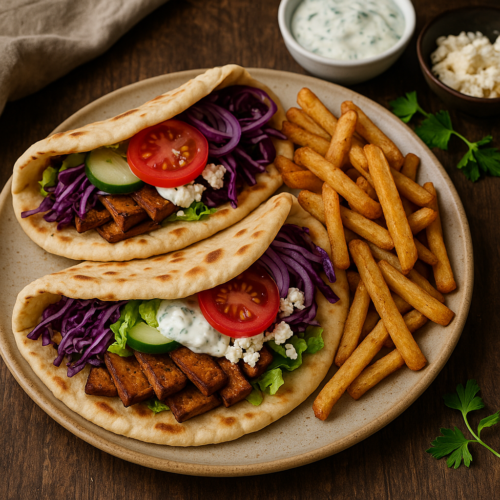

# 🧑‍🍳 Tofu Gyros with Homemade Flatbreads
**By:** Elly Curshen (adapted by Danny-boy)  
**Serves:** 4–5 **Prep:** < 30 mins **Cook:** 25–30 mins  
**Dietary:** Vegetarian Egg-free Nut-free Pregnancy-friendly  

---

## 🫓 Flatbreads (makes 5)

**Ingredients**
- 400 g plain flour, plus extra for dusting  
- 15 g (½ oz) baking powder  
- 350 g (12 oz) Greek-style yoghurt  

**Method**
1. Mix the flour, baking powder and yoghurt in a large bowl until a dough forms.  
2. Knead briefly until smooth, then cover and rest 10–15 min.  
3. Divide into 5 pieces and roll each into an oval about 5 mm (¼ in) thick.  
4. Fry in a dry, hot frying pan for 1–2 min per side until golden.  
5. Stack under a clean tea towel to steam slightly and stay soft for wrapping.  

---

## 🧄 “Gyros Meat” Tofu

**Ingredients**
- 6 tbsp extra-virgin olive oil  
- 2 tsp vegetable bouillon powder  
- 2 tsp honey or maple syrup  
- 2 tbsp soy sauce  
- 2 tsp each: ground cumin, dried parsley, dried oregano, garlic granules, dried rosemary  
- 2 × 225 g smoked tofu, thinly sliced  

**Method**
1. Preheat oven to 220 °C / 200 °C Fan / Gas 7.  
2. Whisk all ingredients (except tofu) into a marinade.  
3. Gently fold in tofu slices and coat well.  
4. Spread evenly on a lined baking tray.  
5. Bake 30 min, turning halfway – edges crisp, centres stay juicy.  

---

## 🍟 Cheaty Oregano Fries

**Ingredients**
- 450–600 g frozen oven chips  
- 2 tbsp dried oregano  
- 1 tbsp garlic granules  
- ½ tsp sea salt  
- 1 tbsp olive oil  

**Method**
1. Toss everything together in a bowl.  
2. Spread on a tray and cook alongside the tofu, timing so they finish together.  
   *(If chips take 20 min, put them in 10 min after the tofu.)*  

---

## 🥗 Optional Toppings
- Shredded lettuce  
- Sliced cucumber, tomato, red onion  
- Crumbled feta  
- Hummus or tzatziki  
- Shredded red cabbage (tossed with olive oil, lemon juice, salt, sugar)  

---

## 🍽️ To Serve
Lay everything out in the centre of the table – warm flatbreads, crispy tofu, seasoned fries, and toppings.  
Wrap, roll, and enjoy a proper Greek-style feast. 🇬🇷  
